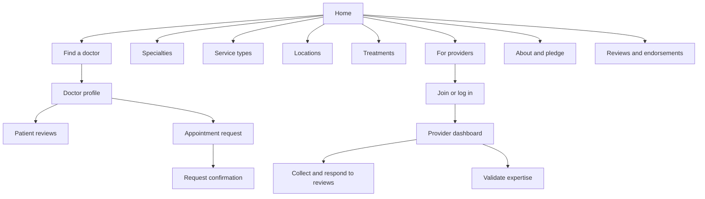

# Mediwell Website Blueprint

## Sitemap



## Wireframe Notes

### Homepage

```text
┌──────────────────────────────────────────────────────────────┐
│ Sticky brand / Find a doctor / Specialties / Provider access │
├──────────────────────────────────────────────────────────────┤
│ Editorial headline + clinician portrait                      │
│ Specialty | Location | Care setting | Search                 │
├──────────────────────────────────────────────────────────────┤
│ Trust principles                                              │
│ Specialty discovery tiles                                     │
│ Sample provider profiles                                      │
│ How it works / patient story / locations                     │
│ Provider invitation / newsletter                              │
└──────────────────────────────────────────────────────────────┘
```

### Doctor Profile

```text
┌──────────────────────────────────────────────────────────────┐
│ Breadcrumbs                                                   │
│ Portrait / Name / Specialty / Rating / Credentials           │
│ About | Reviews | Endorsements | Locations                   │
│ Biography / expertise / reviews / peer endorsement           │
│                                             Booking panel      │
│                                             Select time        │
└──────────────────────────────────────────────────────────────┘
```

### Provider Dashboard

```text
┌──────────────────────────────────────────────────────────────┐
│ Greeting / profile shortcut                                  │
│ Demo disclosure                                               │
├────────────────┬─────────────────────────────────────────────┤
│ Overview       │ Views / requests / rating / completeness     │
│ Your profile   │ Recent patient feedback                      │
│ Reviews        │ Profile checklist                            │
│ Endorsements   │                                             │
│ Analytics      │                                             │
└────────────────┴─────────────────────────────────────────────┘
```

## Palette

| Token | Color | Role |
| --- | --- | --- |
| Primary blue | `#4A90E2` | Links, focus accents, calm emphasis |
| Mint green | `#98FF98` | Healing, confirmation and secondary accents |
| Coral | `#FF6F61` | Warm highlights and calls to notice |
| Warm beige | `#F5F5DC` | Soft neutral surfaces |
| Deep navy | `#1A2A40` | Primary text and strong actions |
| Light gray | `#E0E0E0` | Dividers and outlines |

The interface uses deeper blue for small white-on-blue text controls to preserve WCAG AA contrast. The brighter requested blue remains an accent rather than small white text on a button.

## Content Model

Machine-readable navigation and demo disclosure live in `src/data/content.json`. Directory profiles in `src/lib/directory.ts` define specialty, location, service setting, fee, availability, biography and illustrative review counts.

## Integrations and Launch Notes

- Search and filters run against local sample profiles; replace `src/lib/directory.ts` with a validated API before launch.
- Appointment requests, provider sign-in and dashboard actions are simulated locally. Connect an appointment service and secure identity provider before handling real patient or provider data.
- Maps, analytics, newsletter delivery and a consent-management platform are not configured. No third-party tracking scripts are included.
- Set `NEXT_PUBLIC_SITE_URL` to the verified production origin to generate production sitemap URLs.
- Profile imagery is loaded from Unsplash and requires network access. Replace sample records and obtain appropriate image rights before production.
- Run keyboard, screen-reader, color-contrast and mobile-device tests with representative assistive technology and content before release.